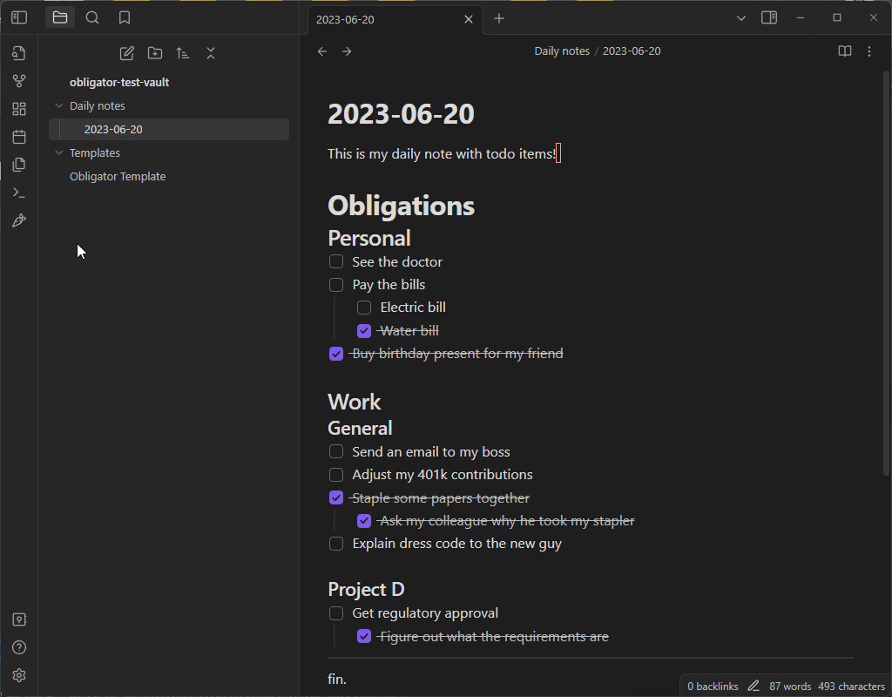

# Obligator

Obligator replaces and extends the function of the built in daily-notes plugin.
With this plugin, you can specify a header containing your todo items. Unchecked
todo items will be copied over to the new daily note. This leaves you with a
running history of your todo-list.

Currently, it will copy over everything (except for checked todo-list items)
between the specified header, and the terminal sequence: `----`. This will
be improved soon.

## How to use Obligator

When you click the carrot icon, if today's note doesn't already exist, a new
note file will be made reflecting today's date. All items between the specified
header and the terminal sequence will be copied over, except for finished todos.

### Template variables
{{date}}, {{time}}, and {{title}} work as they normally would.
in addition, you may use {{previous_note}} and {{previous_note_path}} to create
back-links to the previous note from the current note. If there is no previous
note, then these variables will be blank

---

## TODO

* Add better terminal sequence support

## Building
* `yarn install` (install dependencies)
* `yarn run dev` (compile typescript to javascript `main.js`)
* restart Obsidian, or toggle on and off the plugin

## Releasing
Update the version numbers in `manifest.json` and `package.json` to match, then:
* git tag -a 1.3.1 -m "1.3.1"
* git push origin 1.3.1

### Attributions
* File suggestions code taken from [mirnovov](https://github.com/mirnovov/obsidian-homepage/blob/main/src/suggest.ts)
