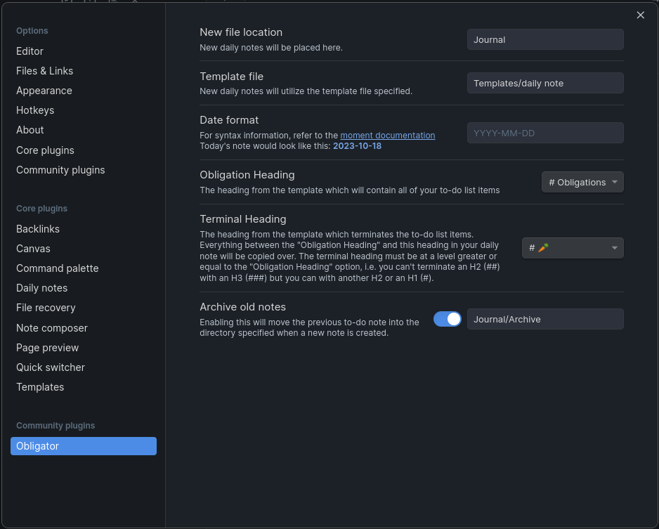

# Obligator

Obligator replaces and extends the function of the built in daily-notes plugin.
With this plugin, you can specify a starting and terminal header in a daily
note template which will contain your to-do items.

Unchecked to-do items will be copied over to the new daily note, along with all
of the headings and formatting structure you used to organize them. It is a
convenient way to manage your to-do list, and leaves you with running history
of to-do items that you can reference if you need to.

## How to use Obligator

When you click the carrot icon, if today's note doesn't already exist, a new
note file will be made reflecting today's date. All items between the specified
header and the terminal header will be copied over, except for finished to-dos.

See the [example template file](example/daily_note.md) for some inspiration on how
to set up your daily note. Also see this sample settings page if you're
confused about how to configure the settings:

### Template variables
 * {{date}}, {{time}}, and {{title}} work as they normally would.

 * {{previous_note}} and {{previous_note_path}} create back-links to the
   previous note from the current note. If there is no previous note, then
   these variables will be blank.

## TO-DO (In priority order)
* Make the fold state carry over to the new note.
* Make it so that checked tasks which have unchecked subtasks will get copied
  over anyway.
* Add a recurring note template.
* Add an option to delete empty headings. (probably defined as a heading which
  has no children, where a child is any value except for another heading of
  greater weight)

## Design Philosophy
### Why does the terminal sequence have to be a header?
The reason for this is to allow the full to-do list to be folded by the header
specified by the Obligation Header option. If any other terminal sequence is
used, the obligation header will fold it because its scope encompases that
terminal sequence.

## Building
* `yarn install` (install dependencies)
* `yarn run dev` (compile typescript to javascript `main.js`)
* restart Obsidian, or toggle on and off the plugin

## Releasing
Update the version numbers in `manifest.json` and `package.json` to match, then:
* git tag -a 1.3.1 -m "1.3.1"
* git push origin 1.3.1

## Attributions
* File suggestions code taken from [mirnovov](https://github.com/mirnovov/obsidian-homepage/blob/main/src/suggest.ts)
