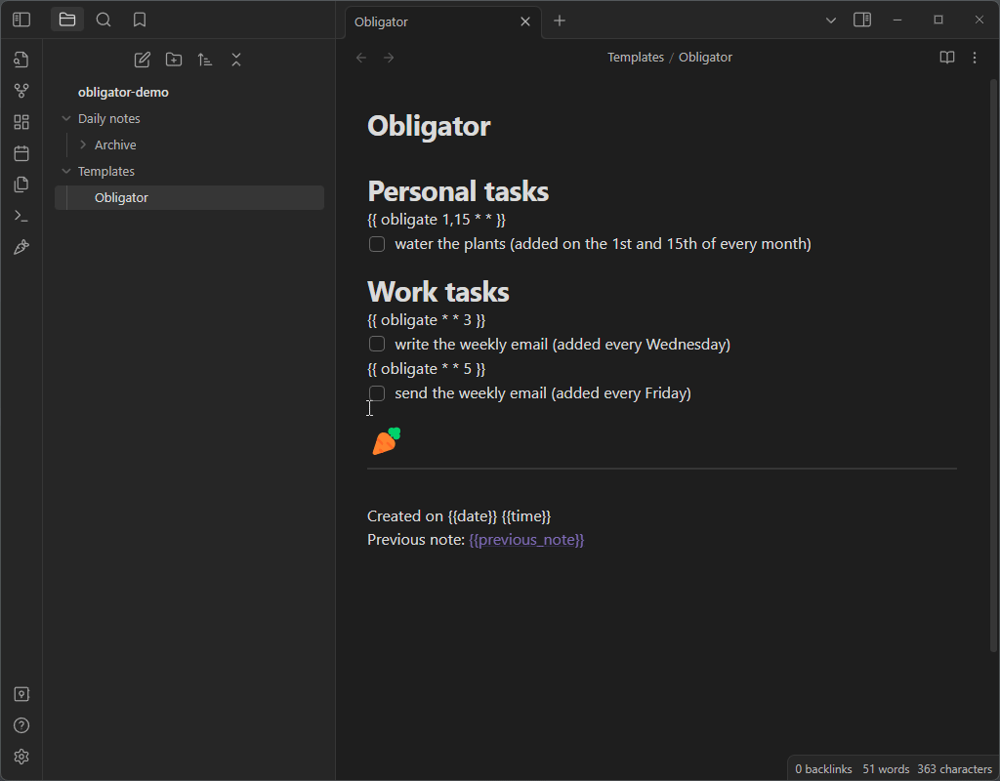

# Obligator

Obligator replaces and extends the function of the built in daily-notes plugin.
This plugin will copy over all of the contents of your daily note file to the
new one *except for* checked boxes.

Unchecked to-do items will be copied over to the new daily note, along with all
of the headings and formatting structure you used to organize them. It is a
convenient way to manage your to-do list, and leaves you with running history
of to-do items that you can reference if you need to.

## How to use Obligator

Make sure you have fully filled out the settings page, then click the carrot
icon. If today's note doesn't already exist, a new note file will be made
reflecting today's date. If it does exist, it will simply bring you to the
existing file.

See the [example template file](example/daily_note.md) for some inspiration on
how to set up your daily note. Here is an animation showing a valid template and
a how to set up the settings properly with that template:

### Template variables
 * {{date}}, {{time}}, and {{title}} work as they normally would.

 * {{previous_note}} and {{previous_note_path}} create back-links to the
   previous note from the current note. If there is no previous note, then
   these variables will be blank.

 * {{ obligate * * * }} is a very powerful template. It lets you set up
   recurring to-do items in your template. It uses a simplified version of the
   cron syntax, where the asterisk represent day-of-the-month,
   month-of-the-year, and day-of-the-week in that order. See [crontab.guru](https://crontab.guru)
   to play around with the syntax. The obligate template will add the immediately
   proceeding line if you the date matches **for any day between your
   last note and today**. See the [example template file](example/daily_note.md)
   for plenty of common examples. If you are confused about this and want some
   help, just open a GitHub issue.

## TO-DO (In priority order)
* Currently if you have sub-tasks on a recurring note, it won't copy over the
  sub-tasks properly
* Make the fold state carry over to the new note.
* Make it so that checked tasks which have unchecked subtasks will get copied
  over anyway.
* Add an option to delete empty headings. (probably defined as a heading which
  has no children, where a child is any value except for another heading of
  greater weight)

## Building
* `yarn install` (install dependencies)
* `yarn build` (compile typescript to javascript `main.js`)
* restart Obsidian, or toggle on and off the plugin
* For development, `yarn dev` listens for changes and rebuilds automatically.

## Releasing
* `yarn version`
* `yarn release`

## Attributions
* File suggestions code taken from [mirnovov](https://github.com/mirnovov/obsidian-homepage/blob/main/src/suggest.ts)
