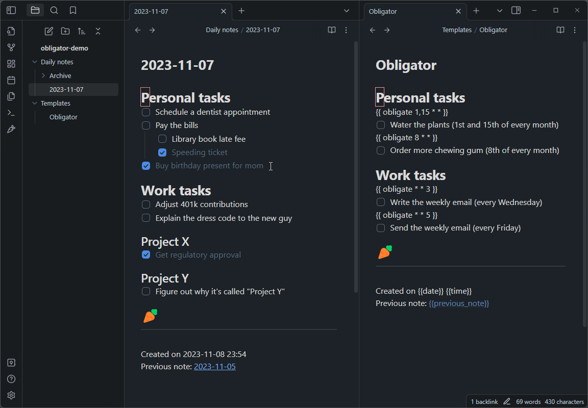

# Obligator

Obligator replaces and extends the function of the built in `Daily notes` plugin.
Unchecked to-do items will be copied over to the new daily note, along with all
of the headings and formatting structure you used to organize them, and any
scheduled notes that you've set up. It is a convenient way to manage your
to-do list, and leaves you with running history of notes that you can
reference if you want to.

## How to use Obligator

Make sure you have fully filled out the settings page, then click the carrot
icon on the sidebar to open your daily note. If today's note doesn't already
exist, a new note file will be made reflecting today's date. If it does exist,
it will simply bring you to the existing file -- so feel free to click that
carrot to your hearts content.

See the [example template file](example/daily_note.md) for some inspiration on
how to set up your daily note. Here is an animation showing a valid template and
a how to set up the settings properly with that template:

### Template macros
 * {{date}}, {{time}}, and {{title}} work as they normally would.

 * {{previous_note}} and {{previous_note_path}} create back-links to the
   previous note from the current note. If there is no previous note, then
   these variables will be blank.

 * {{next_note}} and {{next_note_path}} create forward-links to the
   next note from the last note. These are added to the last note only when a
   new note is made.

 * {{ obligate * * * }} is a very powerful macro. It lets you set up
   recurring to-do items in your template. It uses a simplified version of the
   cron syntax, where the asterisk represent day-of-the-month,
   month-of-the-year, and day-of-the-week in that order. See [crontab.guru](https://crontab.guru)
   to play around with the syntax. The obligate macro will add the immediately
   proceeding line if you the date matches **for any day between your
   last note and today**. See the [example template file](example/daily_note.md)
   for plenty of common examples. If you are confused about this and want some
   help, just open a GitHub issue.

## Comparison with rollover-daily-todos
I was motivated to create this project because my to-do list is extensive, with
lots offormatting that I wanted to maintain between notes, but rollover-daily-todos
copies *only* the unchecked to-do items and places them all into a specified
header, killing all of the formatting.

Here is a basic overview of the differences between the two:

- Obligator copies over all unchecked to-do items as well as all the formatting
  that wraps them.

- Rollover-daily-todos only copies unchecked to-do items, and places them under
  one heading.

- Obligator does not rely on the `Daily notes` or `Periodic notes` plugin.

- Obligator has the {{ obligate * * * }} macro for automatically scheduling
  to-do items in new notes.

- Obligator has an old note archiving feature to keep your notes directory clean.

- Obligator has the ability to delete empty headings to keep your daily note clean.

- Obligator deals with nested to-do items hierarchically, so a checked parent with
  any amount of unchecked children will get copied over wholly to preserve the
  structure.

- & More!

## TO-DO (In priority order)
* Make the fold state carry over to the new note.
* Delete empty headings should retain headings present in the template. Or at
  least there should be an option for that.

## Building
* `yarn install` (install dependencies)
* `yarn build` (compile typescript to javascript `main.js`)
* restart Obsidian, or toggle on and off the plugin
* For development, `yarn dev` listens for changes and rebuilds automatically.

## Releasing
* `yarn version`
* `yarn release`

## Attributions
* File suggestions code taken from [mirnovov](https://github.com/mirnovov/obsidian-homepage/blob/main/src/suggest.ts)
